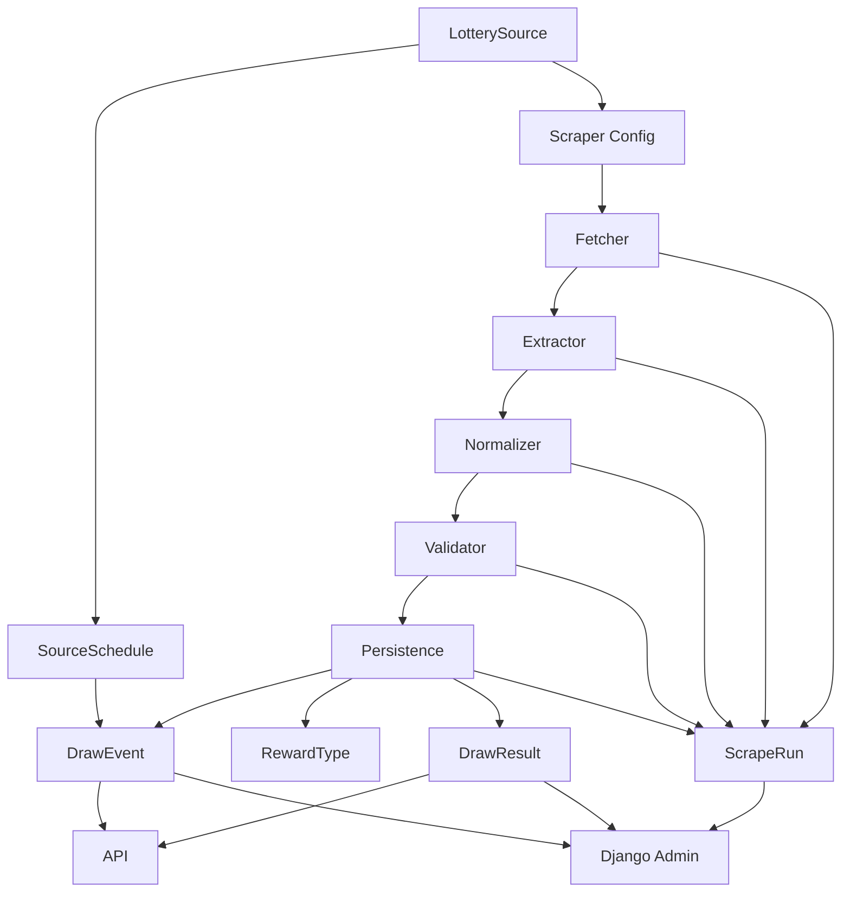

# Lottery Platform

`lottery-platform` is a Django-based rebuild of the legacy `get_huay` project.

Instead of standalone scraping scripts, this version is a small backend platform with:
- scheduled draw modeling
- config-driven scrapers
- PostgreSQL storage
- Django admin
- REST API
- Docker-based local runtime

The legacy `get_huay` project is untouched. This repo is the replacement path, not an in-place refactor.

## Current Scope

Supported source patterns:
- `huayrat`
  - rich source
  - full reward matrix
  - source: Sanook
- simple headline-only sources
  - `huaylao`
  - `huaymaley`
  - `huayhanoy_special`
  - `huayhanoy_normal`
  - `huayhanoy_vip`
  - source: ExpHuay dedicated result pages

Product rule:
- store rich data where downstream logic needs it
- keep simpler sources headline-focused when that is what users actually check

## Stack

- Django
- Django REST Framework
- PostgreSQL
- Docker / Docker Compose
- BeautifulSoup + requests

## Architecture



Main apps:
- `sources`
  - source definitions and schedule rules
- `draws`
  - draw events and runtime date resolution state
- `results`
  - reward types and draw result rows
- `scraping`
  - scraper configs, extraction pipeline, normalization, validation, persistence
- `ops`
  - scrape run history and diagnostics
- `api`
  - public read API

Core model flow:
1. `LotterySource`
2. `SourceSchedule`
3. `DrawEvent`
4. `RewardType`
5. `DrawResult`
6. `ScrapeRun`

Scraper flow:
1. load source config
2. fetch source HTML
3. resolve draw date
4. extract fields
5. normalize values
6. validate output
7. persist draw + results
8. record run metadata

## Draw Date Model

The platform separates:
- `scheduled_date`
  - the requested/target date for the job
- `resolved_date`
  - the actual date parsed from the source page
- `scraped_at`
  - when the platform fetched the source

This matters because some sources do not publish results on the same date passed in the query string.

## Source Strategy

Current source split:
- `huayrat` -> Sanook
- `huaylao` -> ExpHuay
- `huaymaley` -> ExpHuay
- `huayhanoy_special` -> ExpHuay
- `huayhanoy_normal` -> ExpHuay
- `huayhanoy_vip` -> ExpHuay

Why split sources:
- `huayrat` needs richer reward coverage
- the other sources only need the headline reward set
- one source per product need is better than forcing one website to do everything

## Quick Start

1. Copy `.env.example` to `.env`
2. Start containers:

```powershell
docker compose up -d --build
```

3. Run migrations:

```powershell
docker compose exec web python manage.py migrate
```

4. Create admin user:

```powershell
docker compose exec web python manage.py createsuperuser
```

5. Open the app:
- app: `http://localhost:8000`
- admin: `http://localhost:8000/admin`
- health: `http://localhost:8000/health`
- api root: `http://localhost:8000/api/`

## Useful Commands

Run tests:

```powershell
docker compose exec web python manage.py test scraping api
```

Run Django checks:

```powershell
docker compose exec web python manage.py check
```

Run schedule sync:

```powershell
docker compose exec web python manage.py resolve_draw_events --source huayrat --start-date 2026-03-01 --end-date 2026-03-31
```

Run one scraper and persist by default:

```powershell
docker compose exec web python manage.py scrape huaylao
```

Run without writing new draw/result rows:

```powershell
docker compose exec web python manage.py scrape huaylao --no-persist
```

## API

Current public read endpoints:
- `GET /api/`
- `GET /api/sources/`
- `GET /api/sources/<source_code>/`
- `GET /api/sources/<source_code>/results/latest/`
- `GET /api/sources/results/latest/`
- `GET /api/draw-events/`
- `GET /api/draw-events/<id>/`
- `GET /api/draw-events/<id>/results/`
- `GET /api/results/`
- `GET /api/scrape-runs/`
- `GET /api/scrape-runs/<id>/`
- `GET /api/search/?source=<code>&draw_date=YYYY-MM-DD&number=123456`

Search matching rules:
- `front_3_digits` / `top_3_digits` -> first 3 digits
- `back_3_digits` -> last 3 digits
- `last_2_digits` / `bottom_2_digits` -> last 2 digits
- `first_prize`, `near_first_prize`, `prize_2-5`, `full_result` -> full 6 digits
- Fallback: unknown reward types match by value length (6/3/2 digits)

Examples:

```text
/api/sources/huaylao/results/latest/
/api/sources/results/latest/?sources=huaylao,huaymaley
/api/results/?source=huayrat&reward_type=first_prize
/api/draw-events/?source=huaylao&status=completed
/api/search/?source=huayrat&draw_date=2026-03-16&number=510439
```

List endpoints are paginated.
## Admin

Django admin is used as the internal back office.

Current admin improvements:
- source schedules inline under sources
- draw results inline under draw events
- better scrape run inspection
- autocomplete on linked models where useful

## Testing Notes

Current test coverage focuses on:
- rich `huayrat` parsing and persistence
- simple ExpHuay source pattern parsing and persistence
- draw date separation between scheduled vs resolved dates
- API read endpoints
- failure-path diagnostics in `ScrapeRun`

## Environment

See `.env.example` for local runtime values.

Current defaults:
- app timezone: `Asia/Bangkok`
- database host in Docker: `db`

## Future Database Migration

The project already targets PostgreSQL, so moving from the local Docker database to a real PostgreSQL server later should be a configuration change, not an application rewrite.

Expected migration path:
- keep Django models and migrations unchanged
- point `.env` to the real PostgreSQL host, port, database, user, and password
- run `python manage.py migrate` against the new database
- export/import existing data only if local history needs to be preserved
- add backup, credentials, and network rules at deployment time

Current decision:
- stay on Docker PostgreSQL for local development
- delay external PostgreSQL integration until the project actually needs live operation again

## Status

This project is past scaffold stage.

Implemented:
- core domain models
- draw event generation
- config-driven scraping engine
- live source integration
- persistence into platform models
- admin UI
- read API
- Dockerized local runtime

Still open for future work:
- broader source coverage
- more write/admin API surface
- deeper docs and architecture diagram
- deployment polish
