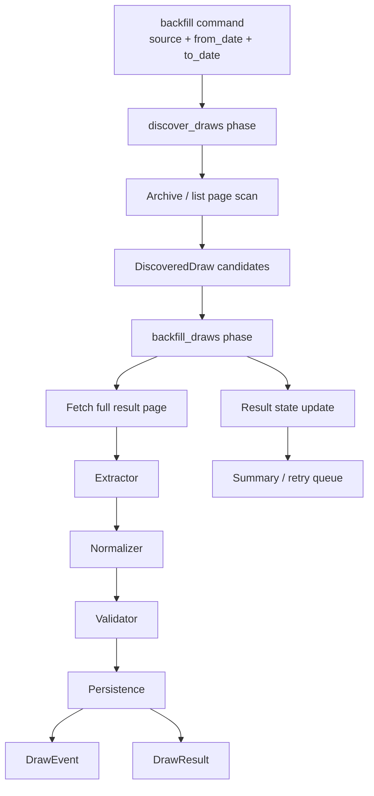

# Roadmap

This file tracks future directions for `lottery-platform` that are worth preserving, but are not part of the current implementation baseline.

The goal is not to fully spec every future feature.
The goal is to capture the design core clearly enough that future work can start from a strong foundation instead of being rediscovered from scratch.

## Historical Backfill Strategy

### Goal

Allow the platform to recover and persist historical lottery results automatically, including sources where real published draw dates drift away from the normal schedule.

### Why this matters

A normal daily scraper only solves current ingestion.
It does not solve historical rebuild.

A naive backfill approach would be:
- generate schedule dates
- loop over them
- try every page

That works only when history is clean.

In real use, history is often messy:
- draw dates can shift because of holidays or special events
- archive URLs may exist only for actual published draws
- theoretical schedule dates can point to nonexistent pages
- brute-forcing every date creates unnecessary requests and noisy failures

The historical solution should therefore follow the same core instinct as the old `period` method:
- discover the real usable draw target first
- scrape using that resolved truth

The new version is broader and more structured than the old approach.

## Design Core

The design should keep two internal phases but expose one main operator command.

### Operator UX

Normal usage should be one command:

```powershell
python manage.py backfill huayrat --from-date 2020-01-01 --to-date 2026-03-26
```

This command should:
1. discover valid historical draw candidates
2. scrape and persist those candidates
3. print a summary of what happened

This keeps the normal path simple.

### Internal Core

Internally, backfill should still be separated into two phases:
- `discover_draws`
- `backfill_draws`

This separation matters because discovery and ingestion solve different problems and have different cost/risk profiles.

### Debug / Low-Level Commands

For inspection, debugging, and recovery, separate commands should still exist:

```powershell
python manage.py discover_draws huayrat --from-date 2020-01-01 --to-date 2026-03-26
python manage.py backfill_draws huayrat --from-date 2020-01-01 --to-date 2026-03-26
python manage.py backfill_draws huayrat --pending-only
```

So the intended shape is:
- `backfill` = default operator UX
- `discover_draws` = debug / inspection
- `backfill_draws` = debug / replay / recovery

## Two-Phase Model

### Phase 1: `discover_draws`

A lightweight discovery phase.

Responsibilities:
- crawl archive pages, list pages, or lightweight source indexes
- discover which historical draws actually exist
- collect real published draw dates
- collect the exact source URL for each discovered draw when possible
- store candidates for later ingestion
- avoid full parsing when only discovery is needed

The discovery phase should be cheap compared to full scraping.

### Phase 2: `backfill_draws`

A heavier ingestion phase.

Responsibilities:
- read discovered candidates
- fetch full result pages
- run the normal scrape pipeline
- persist into `DrawEvent`, `RewardType`, and `DrawResult`
- update candidate state to reflect success, skip, or failure
- produce run summary data for retry and inspection

This phase should reuse the existing normal scraper pipeline instead of inventing a second scraping path.

## Flow



## Why this is better than schedule-only backfill

- uses real published dates instead of guessed dates
- handles holiday drift and irregular history better
- reduces unnecessary requests to pages that never existed
- gives discovery data that can be inspected before ingestion
- makes historical recovery resumable instead of all-or-nothing
- keeps lightweight URL discovery separate from heavy parsing work
- makes retries safer because discovery state can survive partial ingestion failure

## Proposed Future Data Model

A dedicated future model should exist for discovered candidates.
For example: `DiscoveredDraw`.

Suggested fields:
- `source`
- `requested_from_date`
- `requested_to_date`
- `discovered_date`
- `source_url`
- `discovered_at`
- `status`
- `metadata`
- `last_error`
- `scraped_at`

Suggested statuses:
- `discovered`
- `scraped`
- `skipped`
- `failed`
- `retry_pending`

This model should act as the historical truth set for backfill execution.

## State and Safety Rules

Important design rules:
- discovery should not persist final result data
- ingestion should not guess dates when a discovered candidate already exists
- repeated backfill runs must be idempotent
- existing result persistence rules should continue to prevent duplication
- candidate state must make retries possible without re-discovering everything

The current platform already has good idempotency characteristics for `DrawEvent` and `DrawResult`.
This future feature should build on that instead of bypassing it.

## Concurrency Model

Parallelism is a good fit here, but only in the right phase.

### Good parallel targets
- fetching independent discovered result pages
- parsing independent draw pages
- processing retry queues
- splitting large date ranges into chunks

### Bad parallel targets
- duplicate writes against the same draw without idempotent guards
- uncontrolled hammering of a single upstream source
- mixing discovery writes and ingestion writes into the same mutable state blindly

So the intended concurrency model is:
- discovery can be batched carefully
- ingestion can be parallelized by discovered candidate
- persistence remains protected by existing uniqueness/idempotency rules

Short version:
- `1 command` for operator UX
- `2 internal phases` for architecture
- `parallel processing` in the ingestion side when appropriate

## Suggested Summary Output

A future `backfill` run should end with a summary like:
- discovered candidate count
- scraped count
- updated count
- skipped count
- not-found count
- failed count
- retry-pending count

This makes large historical runs understandable without inspecting the database manually.

## Relation to the old system

This keeps the strongest idea from the old `period` method:
- resolve the real usable target first
- scrape using what is actually real, not what the schedule theoretically says

The new design is better because it:
- works across historical ranges, not only current runtime
- separates discovery from ingestion cleanly
- supports retries and resumability
- makes concurrency safer
- gives better observability

So the old method is still the conceptual seed.
The new one is that idea turned into a proper platform workflow.

## Current Decision

Not implemented yet.

Reason:
- current rebuild baseline is already sufficient
- this feature becomes valuable only if the project needs live operation again or historical recovery is required
- preserving the design core now is enough to save future engineering time later
